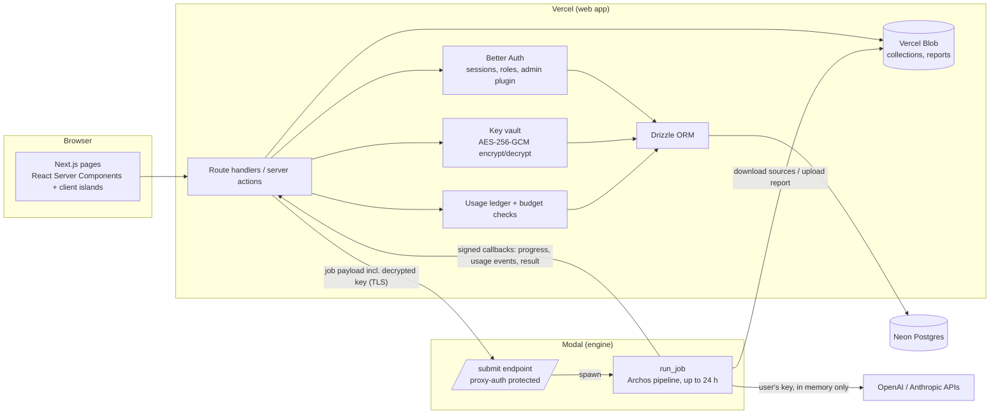

# 01 — Architecture

## The one constraint that shapes everything

Vercel functions are short-lived. With Fluid Compute enabled, the maximum duration is 300 s on Hobby, 800 s on Pro, and 1,800 s as a beta opt-in for Node and Python. An Archos run over a real collection (the headline run synthesised 261 sources into 85,789 words) is a multi-hour job. It cannot run inside a Vercel function, and it should not be rewritten in TypeScript.

So the system is two tiers with a narrow HTTP contract between them:

| Tier | Runs on | Language | Responsibilities |
|---|---|---|---|
| **Web app** | Vercel | Next.js 16 / TypeScript | Login, roles, key vault, collection upload, job submission, report viewer, usage ledger, budgets, admin panel |
| **Engine** | Modal (or an Oxford VM) | Python | The existing Archos pipeline wrapped as a job: retrieve, apply the epistemic constitution, synthesise, emit the Evidence Report, report usage as it goes |

The engine is stateless. It receives everything it needs in the job payload and reports everything back through signed callbacks. That makes it swappable: Modal today, a departmental server tomorrow, without touching the web app.

## Component diagram



## Job lifecycle

```mermaid
sequenceDiagram
  autonumber
  participant H as Historian (browser)
  participant W as Web app (Vercel)
  participant DB as Neon Postgres
  participant E as Engine (Modal)
  participant P as OpenAI / Anthropic

  H->>W: Upload collection files (client upload to Blob)
  H->>W: Submit research question + model choice
  W->>DB: Load user, key row, budget, month-to-date spend
  W->>W: Pre-flight estimate (corpus tokens × passes). Refuse if > remaining budget
  W->>DB: INSERT jobs (status=queued)
  W->>W: Decrypt user's key (AAD = userId + provider)
  W->>E: POST /submit {job_id, provider, model, api_key, sources[], question, budget_usd, callback_url}
  E-->>W: {call_id}
  W->>DB: UPDATE jobs SET engine_call_id, status=running
  loop each LLM call in the pipeline
    E->>P: request with the user's key
    P-->>E: response + usage {input_tokens, output_tokens, cache_*}
    E->>W: POST /api/internal/jobs/{id}/usage (HMAC-signed)
    W->>DB: INSERT usage_events; compute cost; return {remaining_usd}
    alt remaining_usd <= 0
      E->>E: stop gracefully, write partial report
    end
  end
  E->>W: POST /api/internal/jobs/{id}/complete {report_blob_url, stats}
  W->>DB: UPDATE jobs SET status=succeeded, cost_usd, tokens
  H->>W: Open report page (polls job status until done)
```

Notes on the lifecycle:

- **The key travels once**, in the submit payload over TLS, and lives only in the engine container's memory for the duration of the job. It is never written to Modal logs, volumes, or the callback bodies.
- **Progress is push, not pull.** The engine posts events; the web app never has to hold a connection open. The browser polls `GET /api/jobs/{id}` every few seconds (or uses a server-sent events route for a nicer UI later).
- **Budget is enforced twice**: a pre-flight estimate stops hopeless jobs before they start, and the per-call `remaining_usd` reply lets the engine stop mid-run. See `03-usage-metering-and-admin.md`.
- **Idempotency**: every callback carries an `event_id` (UUID) so retries never double-count tokens.

## Data model

Better Auth owns `user`, `session`, `account`, `verification`. The admin plugin adds `role`, `banned`, `banReason`, `banExpires` to `user`. Everything below is ours (Drizzle schema, Postgres).

```
provider_keys
  id              uuid pk
  user_id         → user.id            (null when owner_type = 'team')
  owner_type      'user' | 'team'      team keys are OxARCA-funded shared keys
  provider        'openai' | 'anthropic'
  ciphertext      bytea
  iv              bytea (12 bytes)
  tag             bytea (16 bytes)
  key_version     int                  which master key encrypted it
  last4           text                 for display only
  label           text
  validated_at    timestamptz          last successful GET /v1/models
  revoked_at      timestamptz
  created_at      timestamptz

budgets
  user_id             → user.id pk
  monthly_usd_cap     numeric(10,2)
  per_job_usd_cap     numeric(10,2)
  max_concurrent_jobs int  default 1
  may_use_team_key    bool default false
  updated_by          → user.id
  updated_at          timestamptz

collections
  id, user_id, name, format ('txt'|'tei'|'csv'|'pdf'), file_count,
  total_bytes, blob_prefix, created_at

jobs
  id              uuid pk
  user_id         → user.id
  collection_id   → collections.id
  key_id          → provider_keys.id
  title, research_question   text
  provider, model            text
  status          'queued'|'running'|'succeeded'|'failed'|'cancelled'|'over_budget'
  engine_call_id  text
  estimate_usd    numeric(10,4)
  cost_usd        numeric(10,4)        rolled up from usage_events on completion
  tokens_in, tokens_out  bigint
  report_blob_url text
  error           text
  created_at, started_at, finished_at

usage_events                            the ledger: one row per LLM call
  id              uuid pk               = engine's event_id, unique → idempotent
  user_id         → user.id
  job_id          → jobs.id  (null for interactive calls made by the web app)
  key_id          → provider_keys.id
  provider, model text
  stage           text                  'retrieval' | 'synthesis' | 'verification' | 'chat' ...
  input_tokens, output_tokens, cache_read_tokens, cache_write_tokens  int
  cost_usd        numeric(12,6)         computed at insert time from the price table
  created_at      timestamptz

usage_monthly                           rollup, refreshed by cron and on job completion
  user_id, month (date), tokens_in, tokens_out, cost_usd   pk (user_id, month)

audit_log
  id, actor_id, action, target_type, target_id, metadata jsonb, created_at
  actions: key.saved, key.revoked, budget.changed, user.banned, job.cancelled, ...
```

Indexes that matter: `usage_events(user_id, created_at)`, `usage_events(job_id)`, `jobs(user_id, status)`.

## Routes (web app)

| Route | Kind | Notes |
|---|---|---|
| `/login`, `/signup`, `/verify` | pages | Better Auth UI |
| `/dashboard` | page | jobs list, month-to-date spend, remaining budget |
| `/keys` | page | add / validate / revoke provider keys; shows provider + last4 only |
| `/collections`, `/collections/new` | pages | client upload to Blob |
| `/jobs/new`, `/jobs/[id]` | pages | submit form with pre-flight estimate; live status; report viewer |
| `/usage` | page | per-month tokens and USD, per-job breakdown |
| `/admin/users`, `/admin/users/[id]` | pages | role `admin` only: budgets, ban, revoke keys, impersonate |
| `/admin/jobs`, `/admin/usage`, `/admin/audit` | pages | fleet view |
| `/api/auth/[...all]` | handler | Better Auth |
| `/api/jobs` `POST` | handler | create job: budget check → decrypt key → call engine |
| `/api/jobs/[id]` `GET`, `DELETE` | handler | status; cancel |
| `/api/internal/jobs/[id]/usage` `POST` | handler | engine callback, HMAC-verified |
| `/api/internal/jobs/[id]/complete` `POST` | handler | engine callback, HMAC-verified |
| `/api/blob/upload` `POST` | handler | Blob client-upload token issuance, scoped to the user's prefix |
| `/api/cron/rollup` | handler | Vercel Cron, monthly rollup + key re-validation |

Route protection: Next.js 16 uses `proxy.ts` (the renamed middleware). Use Better Auth's `getSessionCookie()` there for a fast redirect, and verify the session properly with `auth.api.getSession()` inside each page or handler.

## Engine contract (Python, Modal)

```python
# engine/app.py — sketch
import modal

app = modal.App("archos-engine")
image = (modal.Image.debian_slim(python_version="3.12")
         .pip_install_from_pyproject("pyproject.toml"))
secrets = [modal.Secret.from_name("archos-engine")]   # CALLBACK_SECRET, BLOB token

@app.function(image=image, timeout=24 * 60 * 60, secrets=secrets)
def run_job(job: dict) -> None:
    # job = {job_id, provider, model, api_key, sources, question, budget_usd, callback_url}
    reporter = UsageReporter(job["job_id"], job["callback_url"])   # HMAC-signed POSTs
    llm = make_client(job["provider"], job["api_key"])            # per-job client, key never persisted
    report = archos.run(question=job["question"], sources=fetch(job["sources"]),
                        llm=llm, on_usage=reporter.record)         # stops when reporter says budget is gone
    url = upload_report(report)
    reporter.complete(report_blob_url=url, stats=report.stats)

@app.function(image=image, secrets=secrets)
@modal.fastapi_endpoint(method="POST", requires_proxy_auth=True)
def submit(job: dict) -> dict:
    call = run_job.spawn(job)
    return {"call_id": call.object_id}
```

- Modal function timeouts go up to 24 hours; `.spawn()` returns immediately with an ID and results are retrievable for 7 days.
- `requires_proxy_auth=True` makes Modal reject any request without the team's proxy-auth token pair, which the web app sends as headers.
- `on_usage` is the hook the pipeline already needs anyway: after every provider call, pass the response's `usage` object to the reporter. For Anthropic that is `input_tokens`, `output_tokens`, `cache_read_input_tokens`, `cache_creation_input_tokens`; for OpenAI's Responses API it is `input_tokens`, `output_tokens`, `input_tokens_details.cached_tokens`.

If the team would rather host on an Oxford VM: keep the same two endpoints (`POST /submit` returning an ID, plus the outbound callbacks) behind FastAPI with a worker queue such as `arq`. Nothing in the web app changes.

## Where data lives

Archival material can be sensitive and rights-encumbered. Pick UK/EU regions everywhere:

- Neon: an EU region (London `aws-eu-west-2` or Frankfurt).
- Vercel functions: set the project's function region to London (`lhr1`) so they sit next to the database.
- Vercel Blob: private access only; the engine gets time-limited URLs.
- Modal: region selection is available; choose EU if the plan allows, and confirm with the collection owner before uploading anything.
- Retention: a `collections.delete` action must delete the Blob objects, not just the row.

## Two deliberate non-choices

- **Not routing every call through Vercel AI Gateway (yet).** The gateway now supports request-scoped BYOK (`providerOptions.gateway.byok`) and per-user reporting, which is attractive. But it needs the paid tier with purchased credits, and if a user's key fails it silently falls back to system credentials billed to OxARCA's credits. For v1 the ledger is ours and the calls go direct. Revisit once budgets are proven.
- **Not using Vercel Workflows for orchestration.** Workflows (GA since April 2026) would be the right tool if the long-running part were TypeScript. It is Python, so Modal plus callbacks is simpler.
